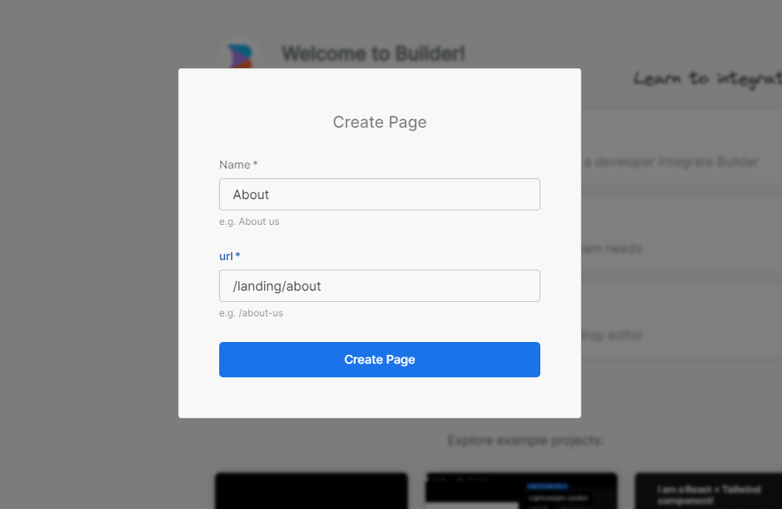
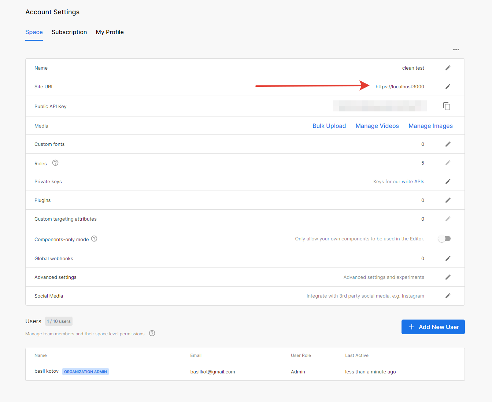
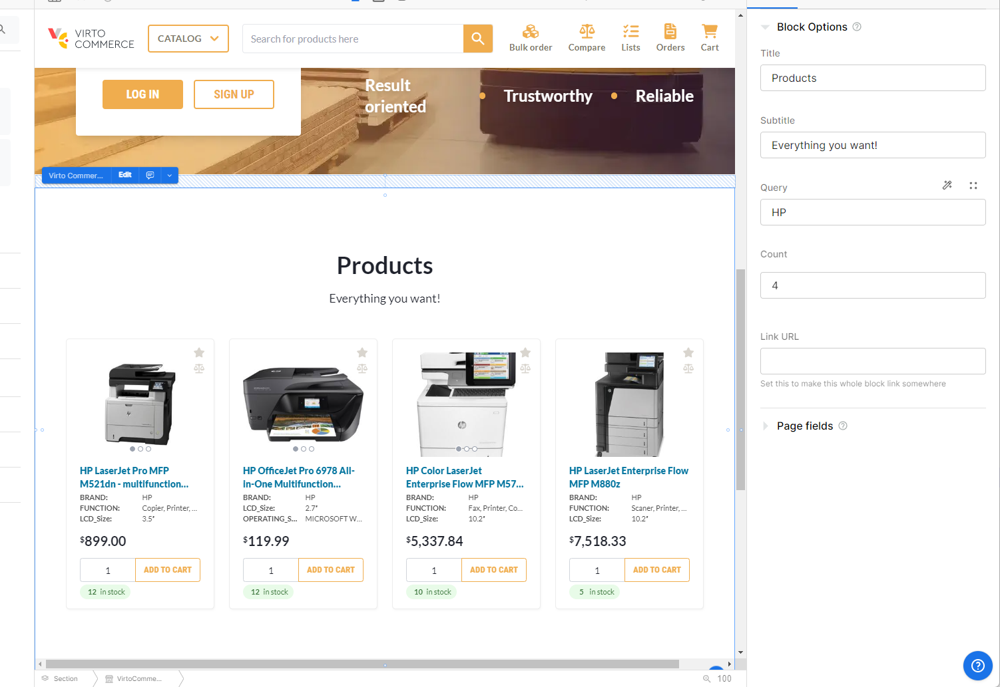
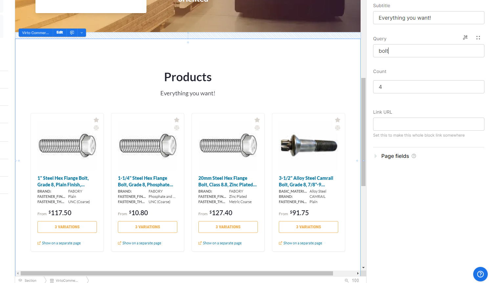
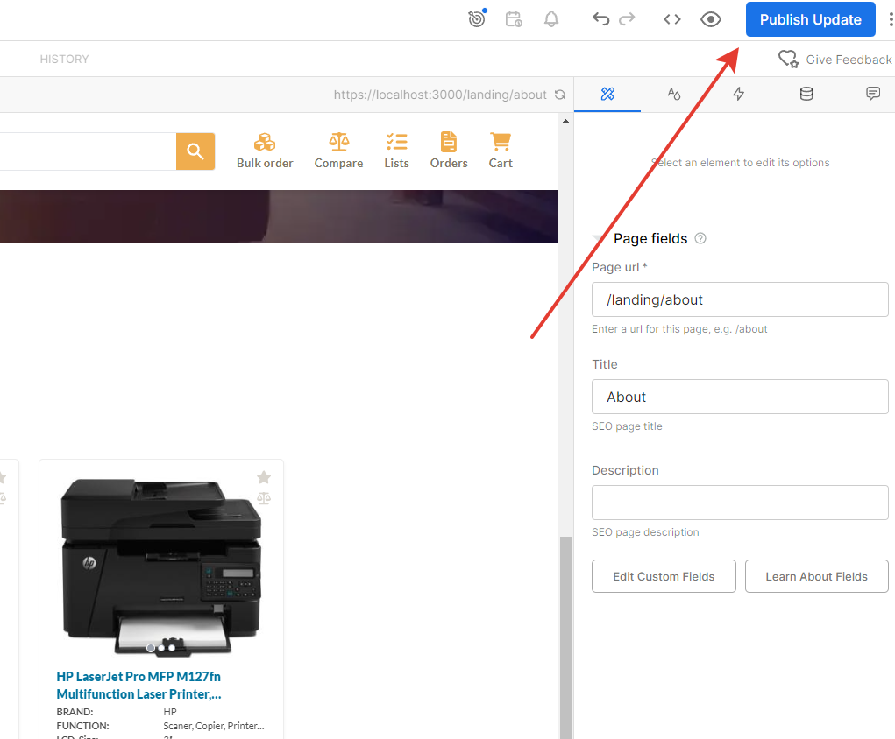
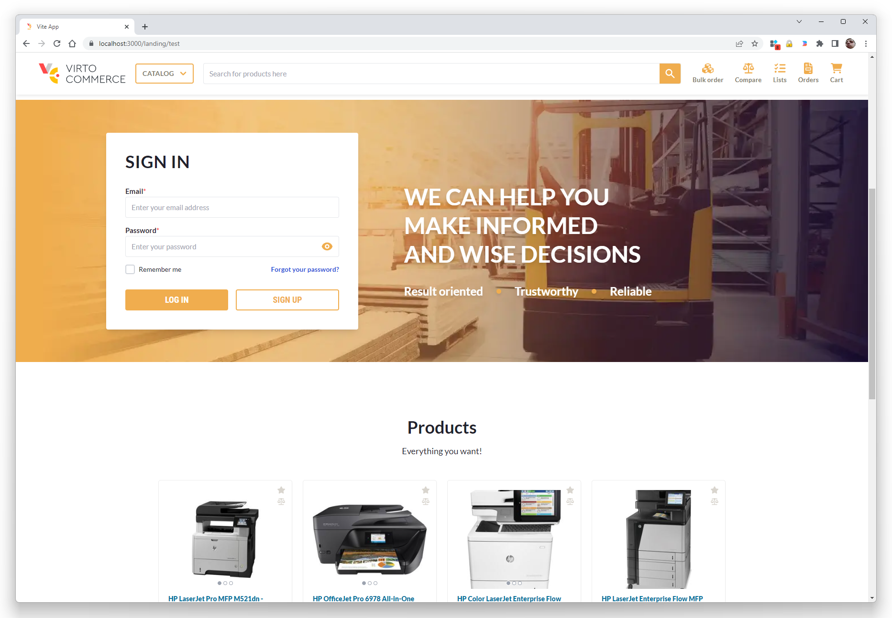

# This is an example description! An afficial readme is [here](https://github.com/VirtoCommerce/vc-theme-b2b-vue/blob/dev/README.md).

# Howto integrate builder.io pages into the VC theme.

In this artcile I'm going to create a landing page created in [builder.io](https://builder.io/) CMS.

1. Clone the [latest theme commit](https://github.com/VirtoCommerce/vc-theme-b2b-vue.git)

2. Add new component into the pages folder. Lets call it `Landing`.

```html
<template>
  <div>
    <div v-if="canShowContent">
      <RenderContent model="page" :content="content" :api-key="apiKey" />
    </div>
    <NotFound v-if="pageNotFound" />
  </div>
</template>

<script setup lang="ts">
import { getContent, RenderContent, isPreviewing } from "@builder.io/sdk-vue/vue3";
import { onMounted, ref } from "vue";
import NotFound from "./404.vue";

const canShowContent = ref(true);
// eslint-disable-next-line @typescript-eslint/no-explicit-any
const content: any = ref(null);
const pageNotFound = ref(false);
const apiKey = "<public api key>";

onMounted(async () => {
  const result = await getContent({
    model: "page",
    apiKey: apiKey,
    userAttributes: {
      urlPath: window.location.pathname,
    },
  });
  content.value = result;
  canShowContent.value = content.value || isPreviewing();
  if (!content.value) {
    pageNotFound.value = true;
  }
});
</script>
```
public api key is in [account settings](https://builder.io/account/space)

More infomation is in the [official documentation](https://www.builder.io/c/docs/integrating-builder-pages)

3. In order to add a custom component it's neccessary to add the following code into `landing.vue`

```html
<script setup lang="ts">
...
import Login from "@/shared/static-content/components/login.vue";
import ProductsBlock from "@/shared/static-content/components/products-block.vue";

...
function getRegisteredComponents() {
  return [
    {
      component: Login,
      name: "VirtoCommerce Login",
      canHaveChildren: false,
      image: "https://tabler-icons.io/static/tabler-icons/icons-png/3d-cube-sphere-off.png",
      inputs: [],
    },
    {
      component: ProductsBlock,
      name: "VirtoCommerce Products",
      canHaveChildren: false,
      image: "https://tabler-icons.io/static/tabler-icons/icons-png/building-store.png",
      inputs: [
        {
          name: "model",
          type: "object",
          defaultValue: {},
          subFields: [
            {
              name: "title",
              type: "string",
            },
            {
              name: "subtitle",
              type: "string",
            },
            {
              name: "query",
              type: "string",
            },
            {
              name: "count",
              type: "number",
            },
          ],
        },
      ],
    },
  ];
}
```

And add the `custom-components` property to the `RenderContent` component

```html
<RenderContent model="page" :content="content" :api-key="apiKey" :custom-components="getRegisteredComponents()" />
```

4. Add route rule  in the `router/routes/main.ts` file.
```ts
...
// import component
const Landing = () => import("@/pages/landing.vue");
...
// add rule before the last one
{ path: "/landing/:pathMatch(.*)*", name: "Landing", component: Landing, props: true },
...
```

In some cases, import from `@builder.io/sdk-vue/vue3` throw a compile time error. To solve it, add a new file into project root. Lets name it `vue-builder-io.d.ts` and write in it

```ts
declare module "@builder.io/sdk-vue/vue3";
```

5. Go to the `builder.io` app and add a new page



Then open an [account settings](https://builder.io/account/space) and set the preview url


6. Add blocks into page in the page designer


For the products block, fill the `query` property with `HP` value.



or the `bolt` balue



7. Publish page


8. Run local app with the `yarn run dev` command

9. Open [the About page](https://localhost:3000/landing/about)


You can find this example on [`github`](https://github.com/VirtoCommerce/vc-theme-b2b-vue/tree/integrations/builder.io).

